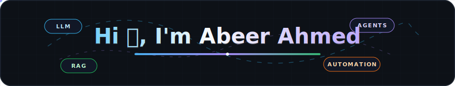

  

<h3 align="center">
AI Product Engineer | LLM Apps • AI Agents • RAG • Automation • SaaS
</h3>

  

  

---

## 🚀 About Me

- 🎓 Bachelor's in Computer Science from COMSATS University Islamabad, Lahore Campus
- 💻 Full Stack Developer with 4+ years of experience building production web applications
- 🤖 Focused on LLM-powered products, AI agents, RAG systems, automation workflows, and intelligent user experiences
- 🧱 Experienced across frontend, backend, databases, cloud deployment, and full stack product architecture
- ⚙️ Strong with modern JavaScript/TypeScript ecosystems, backend APIs, and cloud-based product delivery
- ☁️ Experience deploying and managing applications on AWS, DigitalOcean, Vercel, Firebase, and Docker-based environments
- 🚀 Interested in turning AI ideas into reliable, usable, real-world SaaS products

---

## 🤖 AI Engineering Focus

<table>
  <tr>
    <td width="33%">
      <h3 align="center">🧠 LLM Products</h3>
      

        
        
        
      

      
AI-powered apps, chat experiences, assistants, summarization, recommendations, and intelligent UX flows.

    </td>
    <td width="33%">
      <h3 align="center">⚙️ Agents & Automation</h3>
      

        
        
        
      

      
Workflow automation, tool-using agents, backend orchestration, and AI systems that connect with real products.

    </td>
    <td width="33%">
      <h3 align="center">🚀 Full Stack AI</h3>
      

        
        
        
      

      
Frontend, APIs, databases, cloud deployment, and production-ready architecture for AI-enabled platforms.

    </td>
  </tr>
</table>

---

## 🛠️ Tech Stack

### 🤖 AI & Automation

### 🎨 Frontend

### ⚙️ Backend

### 🗄️ Databases

### ☁️ Cloud & Infrastructure

### 🛠️ Development Tools

---

## 🌟 Featured Projects

### 🖼️ [AI Image Comparison](https://ai-compare-hub.com/)
AI-powered multimedia generation and comparison platform with credits, storage, public/private galleries, and leaderboard rewards.

**Stack:** React, Django, Tailwind CSS, Stripe, AWS

### 📚 [D Libro](http://d-libro.com/)
Full-stack platform built for performance, scalability, and search visibility.

**Stack:** Next.js, Django, AWS, PostgreSQL

### 🦷 Dental Huddle / OneHudl
HIPAA-conscious dental practice operations workspace for huddles, schedules, intake, messaging, inventory, reporting, roles, audit logs, and secure workflows.

**Stack:** React, TypeScript, Node.js, Express, PostgreSQL, Drizzle ORM, AWS S3

### 🗺️ [Roam Around](https://layla.ai/)
AI trip-planning experience powered by a modern full-stack architecture.

**Stack:** Next.js, NestJS, OpenAI API

### 🏫 [Better School Events](https://betterschoolevents.com/)
Polished frontend for school event workflows with payment integration.

**Stack:** React, Stripe, SCSS

### 🧑‍💼 [HR Forum](https://thoughtshr.com/feeds)
Responsive frontend experience built for clean content, smooth usability, and modern web performance.

**Stack:** Next.js, TypeScript, Tailwind CSS

### 🛏️ [PJT Futon]
Responsive landing page for a Japan-based custom pillows and mattresses company, focused on quality, craftsmanship, and smooth performance.

**Stack:** Next.js, Tailwind CSS

### 💧 [OneDrops](https://www.onedrops.com/)
Corporate landing page for a Japan-based company helping PM and PMO leaders execute overseas business strategies.

**Stack:** Next.js, Tailwind CSS

### 🧩 OBB Platform
Full-stack operational platform built with React, Express, Redux, and MUI.

**Stack:** React, Express, Redux, MUI

### 🔋 [Enxsys](https://www.enxsys.com/)
Frontend product experience for Enxsys using React, Firebase, and MongoDB-backed workflows.

**Stack:** React, Express, Firebase, MongoDB

---

## 📈 GitHub Activity

---

## 🎯 Current Focus

- 🤖 AI-Powered Products & LLM Integrations
- 🧠 AI Agents, RAG Systems & Workflow Automation
- 🧩 Full Stack Product Architecture
- ⚙️ Scalable Backend Systems & API Design
- ☁️ Cloud Deployments & Infrastructure
- 🚀 SaaS Product Development

---

## 📫 Connect With Me

- 💼 [LinkedIn](https://www.linkedin.com/in/abeer-ahmad-5623181b7/)
- 🌐 [Portfolio](https://portfolio-abeer-ahmed.vercel.app/)
- 📧 [Email](mailto:abeerahmad389@gmail.com)

---

  <i>"Building practical AI products that are useful, scalable, and easy to use."</i>

